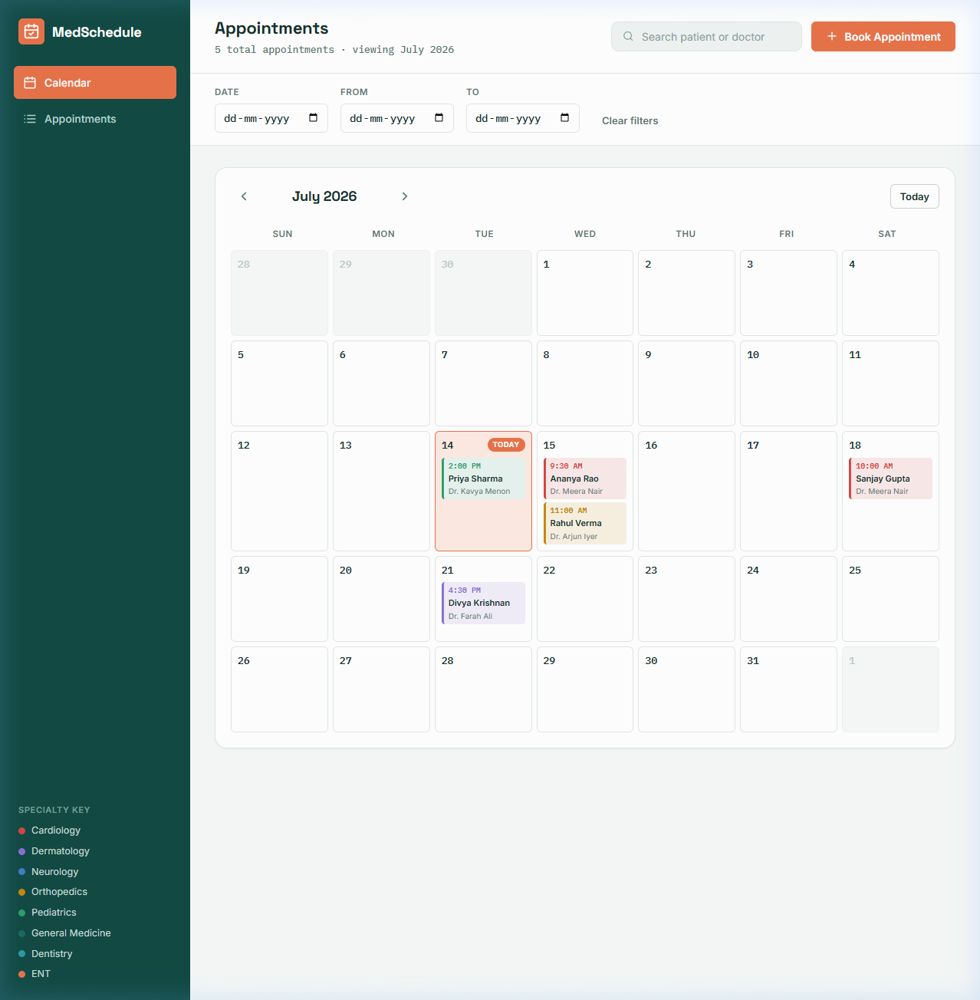
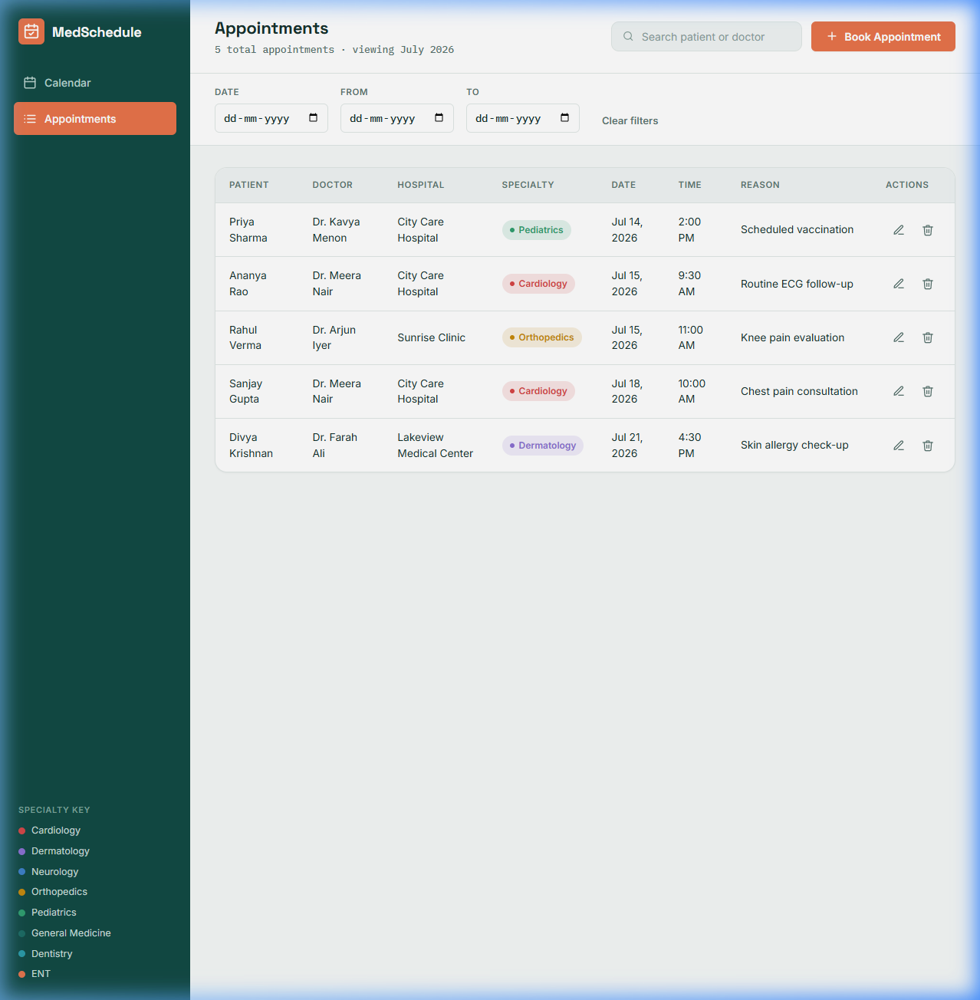
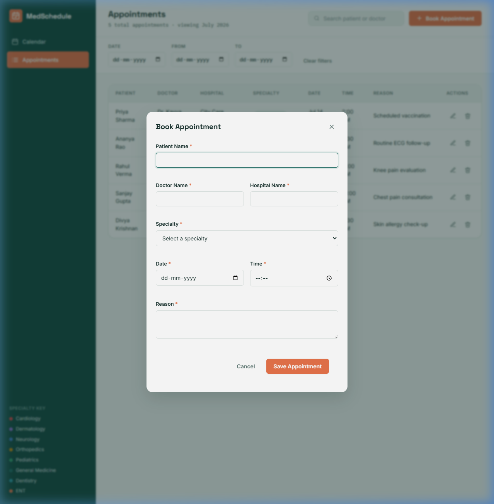
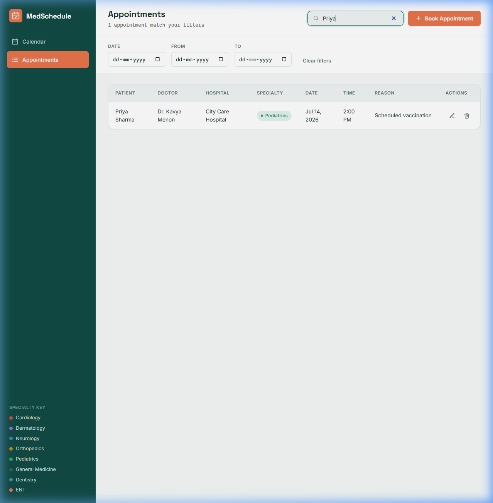

<p align="center">
  
</p>

<h1 align="center">📅 MedSchedule — Appointment Scheduling Web Application</h1>

<p align="center">
  A complete, production-ready appointment scheduling system for healthcare — built entirely with <strong>vanilla HTML5, CSS3, and JavaScript (ES6)</strong>. No frameworks. No libraries. No dependencies.
</p>

<p align="center">
  
  
  
  
</p>

<p align="center">
  <a href="#-features">Features</a> •
  <a href="#-screenshots">Screenshots</a> •
  <a href="#-getting-started">Getting Started</a> •
  <a href="#-project-structure">Project Structure</a> •
  <a href="#-technical-highlights">Technical Highlights</a> •
  <a href="#-license">License</a>
</p>

---

## ✨ Features

### 📆 Calendar View
- **Monthly calendar grid** built completely from scratch — no calendar plugins or date libraries
- **Previous / Next month** navigation with smooth transitions
- **Today's date** highlighted with a distinct accent badge
- **Appointment chips** rendered inside each day cell showing patient name, doctor, and time
- **Click any day** to view all appointments or book a new one
- **"+ N more" overflow** button when a day has too many appointments

### 📋 Appointment List View
- **Desktop table** with sortable columns: Patient, Doctor, Hospital, Specialty, Date, Time, Reason
- **Mobile card layout** that replaces the table on smaller screens
- **Color-coded specialty pills** (Cardiology, Dermatology, Neurology, etc.)
- **Past appointments** visually dimmed with reduced opacity
- **Empty state** with a call-to-action when no appointments exist

### ➕ Full CRUD Operations
| Operation | Description |
|-----------|-------------|
| **Create** | Book a new appointment through a modal dialog with all required fields |
| **Read** | View appointments on the calendar grid and in the list/table view |
| **Update** | Edit any existing appointment — modal pre-fills with current data |
| **Delete** | Remove appointments with a confirmation dialog to prevent accidents |

### 🔍 Search & Filtering
- **Search** by patient name or doctor name (debounced for performance)
- **Filter by exact date** using a date picker
- **Filter by date range** (from / to) for viewing a specific window
- Smart mutual exclusion: selecting a single date clears the range, and vice versa
- **"Clear filters"** button to reset everything in one click
- Filters dynamically update **both** the calendar view and the appointment list

### 💾 Persistent Storage
- All appointments are stored in **`localStorage`** as JSON
- Data loads automatically on every page refresh
- First-run **sample data seeding** so the UI isn't empty on initial load
- Graceful error handling for corrupt or unavailable storage

### 🛡️ Validation & Business Rules
- All form fields are **required** with inline error messages
- **Invalid date prevention** — malformed dates are rejected
- **Doctor overlap detection** — the same doctor cannot be double-booked at the same date and time
- Clear, actionable error messages displayed in the form

### 🎨 UI/UX Polish
- **Smooth modal animations** (pop-in on desktop, slide-up on mobile)
- **Toast notifications** after every save, update, and delete action
- **Hover effects** and button press transitions throughout
- **Keyboard support** — Escape closes modals, Enter/Space activates calendar days
- **Accessible forms** with proper labels, ARIA attributes, and focus management
- **Skip-to-content** link for screen reader users
- **Reduced motion** media query support

### 📱 Fully Responsive
| Breakpoint | Layout |
|------------|--------|
| **Desktop** (> 1024px) | Sidebar + header + calendar/table |
| **Tablet** (641–1024px) | Off-canvas drawer + responsive grid |
| **Mobile** (≤ 640px) | Single-column, bottom-sheet modals, card list |
| **Small phones** (≤ 380px) | Further tightened spacing |

---

## 📸 Screenshots

<table>
  <tr>
    <td align="center"><strong>📆 Calendar View</strong></td>
    <td align="center"><strong>📋 Appointments List</strong></td>
  </tr>
  <tr>
    <td></td>
    <td></td>
  </tr>
  <tr>
    <td align="center"><strong>➕ Book Appointment Modal</strong></td>
    <td align="center"><strong>🔍 Search & Filter</strong></td>
  </tr>
  <tr>
    <td></td>
    <td></td>
  </tr>
</table>

---

## 🚀 Getting Started

### Prerequisites

- A modern web browser (Chrome, Firefox, Safari, Edge)
- Any local HTTP server (optional — for best results)

### Option 1: Open Directly

Simply open `index.html` in your web browser:

```bash
# Clone the repository
git clone https://github.com/sanjai1322/APPOINTMENT-BOOKING.git

# Navigate to the project
cd APPOINTMENT-BOOKING

# Open in browser (macOS)
open index.html

# Open in browser (Windows)
start index.html

# Open in browser (Linux)
xdg-open index.html
```

### Option 2: Local HTTP Server

For the best experience, serve the files with any static HTTP server:

```bash
# Using Node.js http-server (install once globally)
npx http-server ./ -c-1 -o

# Using Python 3
python -m http.server 8080

# Using PHP
php -S localhost:8080
```

Then open **http://localhost:8080** in your browser.

---

## 📁 Project Structure

```
APPOINTMENT-BOOKING/
│
├── index.html                 # Main application page (single-page app)
│
├── css/
│   ├── style.css              # Design tokens, base layout, reusable UI primitives
│   ├── calendar.css           # Monthly calendar grid, day cells, appointment chips
│   ├── modal.css              # Overlay, dialog animations, form modal styles
│   └── responsive.css         # Breakpoints: desktop, tablet, mobile, small phones
│
├── js/
│   ├── storage.js             # localStorage CRUD primitives (no DOM access)
│   ├── calendar.js            # Calendar grid renderer + day-detail popover
│   ├── appointments.js        # Appointment list (table + mobile cards) + delete flow
│   ├── modal.js               # Book/Edit modal, form validation, submit handler
│   ├── search.js              # Search + date/range filter logic
│   └── app.js                 # Bootstrap, state management, utilities, toasts
│
├── assets/
│   └── screenshots/           # Application screenshots for README
│
└── README.md                  # This file
```

### Architecture

```
┌─────────────────────────────────────────────────────┐
│                    index.html                        │
│              (Single HTML Document)                  │
├─────────────────────────────────────────────────────┤
│                                                      │
│  ┌──────────┐  ┌──────────┐  ┌──────────────────┐  │
│  │ storage  │  │ calendar │  │  appointments    │  │
│  │   .js    │  │   .js    │  │      .js         │  │
│  │          │  │          │  │                   │  │
│  │ CRUD     │  │ Grid     │  │ Table + Cards    │  │
│  │ Storage  │  │ Chips    │  │ Delete confirm   │  │
│  │ No DOM   │  │ Day popup│  │                   │  │
│  └────┬─────┘  └────┬─────┘  └────┬──────────────┘  │
│       │              │             │                  │
│  ┌────┴─────┐  ┌────┴─────┐  ┌───┴──────────────┐  │
│  │  modal   │  │  search  │  │     app.js        │  │
│  │   .js    │  │   .js    │  │                   │  │
│  │          │  │          │  │ AppState           │  │
│  │ Form     │  │ Filter   │  │ refreshApp()      │  │
│  │ Validate │  │ Debounce │  │ Toasts, Nav       │  │
│  │ Submit   │  │          │  │ Bootstrap          │  │
│  └──────────┘  └──────────┘  └───────────────────┘  │
│                                                      │
└─────────────────────────────────────────────────────┘
```

---

## 🔧 Technical Highlights

### Zero Dependencies
This entire application is built without **any** external libraries, frameworks, or plugins:
- ❌ No React, Angular, or Vue
- ❌ No Bootstrap or Tailwind
- ❌ No jQuery
- ❌ No calendar libraries (FullCalendar, etc.)
- ❌ No date libraries (Moment.js, Day.js, etc.)
- ✅ Pure HTML5 + CSS3 + Vanilla JavaScript (ES6)

### Design System
The CSS follows a **design token architecture** with CSS custom properties:
- **Color palette** — surfaces, brand colors, status colors with light variants
- **Typography** — Space Grotesk (display), Inter (body), IBM Plex Mono (data)
- **Spacing & geometry** — consistent border radii, sidebar width, header height
- **Elevation** — three shadow levels (sm, md, lg)
- **Transitions** — fast (140ms) and base (220ms) with custom easing curves

### Performance
- **DocumentFragment** used for batch DOM insertions (calendar grid, table rows)
- **Debounced search** (180ms) to avoid excessive re-renders while typing
- **Single refresh loop** (`refreshApp()`) — every CRUD action and filter change goes through one centralized render path
- **No unnecessary re-renders** — state changes are the only trigger

### Accessibility (a11y)
- Semantic HTML5 (`<main>`, `<nav>`, `<aside>`, `<header>`)
- ARIA roles: `role="grid"`, `role="dialog"`, `aria-modal`, `aria-label`, `aria-live`
- Skip-to-content link
- Focus management on modal open
- `prefers-reduced-motion` media query
- `focus-visible` outlines for keyboard navigation

### Security
- All user input is **HTML-escaped** before insertion via `innerHTML` to prevent XSS
- No `eval()` or `Function()` constructors used anywhere
- `JSON.parse()` wrapped in try-catch for storage resilience

---

## 🎨 Specialty Color Key

| Specialty | Color |
|-----------|-------|
| 🔴 Cardiology | `#D64545` |
| 🟣 Dermatology | `#8B6FD1` |
| 🔵 Neurology | `#3D7FC7` |
| 🟡 Orthopedics | `#C6890B` |
| 🟢 Pediatrics | `#2F9E6E` |
| 🩻 General Medicine | `#1B6B63` |
| 🦷 Dentistry | `#2A9AA8` |
| 🟠 ENT | `#E8734A` |

---

## 🧪 Testing

### Manual Testing Checklist

- [ ] **Create** — Book a new appointment and verify it appears in both calendar and list
- [ ] **Read** — Refresh the page and confirm all data persists from localStorage
- [ ] **Update** — Edit an existing appointment and verify changes reflect everywhere
- [ ] **Delete** — Delete an appointment, confirm the dialog, verify removal
- [ ] **Search** — Type a patient or doctor name and confirm filtering works
- [ ] **Date filter** — Pick a specific date and verify only matching appointments show
- [ ] **Date range** — Set a from/to range and verify results
- [ ] **Overlap prevention** — Try booking the same doctor at the same date/time
- [ ] **Validation** — Submit an empty form and verify all error messages appear
- [ ] **Responsive** — Resize browser to test desktop → tablet → mobile transitions
- [ ] **Keyboard** — Navigate with Tab, activate with Enter/Space, close with Escape
- [ ] **Toast** — Verify success toasts appear after create, update, and delete

---

## 🤝 Contributing

Contributions are welcome! Here's how:

1. **Fork** the repository
2. **Create** a feature branch: `git checkout -b feature/amazing-feature`
3. **Commit** your changes: `git commit -m 'Add amazing feature'`
4. **Push** to the branch: `git push origin feature/amazing-feature`
5. **Open** a Pull Request

---

## 📄 License

This project is open source and available under the [MIT License](LICENSE).

---

## 👤 Author

**Sanjai** — [@sanjai1322](https://github.com/sanjai1322)

---

<p align="center">
  <strong>⭐ If you found this project useful, please give it a star!</strong>
</p>
